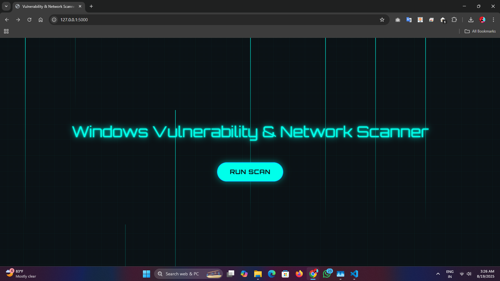

# 🛡️ Windows Vulnerability & Network Scanner

A Python-based **Agent-less Windows System Vulnerability & Network Scanner** that helps detect system information, weak accounts, open ports, missing updates, and network activity. Designed for **learning, research, and industrial training projects** such as **Smart India Hackathon (SIH 2025)**.

---

## ✨ Features

✅ Gather **system information** (OS, hostname, IP, architecture)
✅ Detect **user accounts & weak passwords**
✅ Perform **open port scanning** (custom or common ports)
✅ Check for **pending Windows updates**
✅ Scan the **LAN network** to identify active hosts
✅ Generate **detailed reports** in CSV/PDF format
✅ Optional **GUI dashboard** for easy visualization

---

## 📂 Project Structure

```plaintext
WindowsVulnScanner/
│
├── README.md               # Project overview and instructions
├── requirements.txt        # Python dependencies
├── main.py                 # Main script to run scanner
├── config.py               # Configurable options (ports, scan type)
│
├── modules/                # Python modules for better organization
│   ├── system_info.py      # Detect OS, hostname, IP, architecture
│   ├── user_accounts.py    # Detect users & weak passwords
│   ├── port_scan.py        # Scan open ports
│   ├── updates_check.py    # Check Windows updates
│   ├── network_scan.py     # LAN network scanning
│   └── report_generator.py # Generate CSV/PDF reports
│
├── reports/                # Store generated reports
│   ├── system_report.csv
│   └── system_report.pdf
│
├── gui/                    # Optional GUI folder
│   └── dashboard.py        # Tkinter / PySimpleGUI interface
│
├── assets/                 # Optional folder for images/icons for GUI
│   └── logo.png
```

---

## ⚙️ Installation

### 1️⃣ Clone the Repository

```bash
git clone https://github.com/your-username/WindowsVulnScanner.git
cd WindowsVulnScanner
```

### 2️⃣ Install Dependencies

```bash
pip install -r requirements.txt
```

### 3️⃣ Run the Scanner

```bash
python main.py
```

(Optional GUI)

```bash
python app.py
```

---

## Preview


## 🚀 Usage

### Example: Run a Full Scan

```
$ python main.py
[INFO] Collecting system information...
[INFO] Scanning user accounts...
[INFO] Performing port scan on common ports...
[INFO] Checking for pending Windows updates...
[INFO] Scanning local network for active hosts...
[INFO] Report generated: reports/system_report.pdf
```

---

## 📊 Example Report Output

**System Information**

* Hostname: DESKTOP-12345
* OS: Windows 10 Pro (64-bit)
* IP: 192.168.1.100

**User Accounts**

* Admin (Weak Password Found: YES)
* Guest (Disabled)

**Open Ports**

* 22 (SSH)
* 80 (HTTP)
* 445 (SMB – Vulnerable)

**Windows Updates**

* Critical Update Missing: KB5021234

---

## 🛠️ Technologies Used

* **Python 3.8+**
* **socket** (network communication)
* **subprocess / os** (system info, update check)
* **threading** (faster scans)
* **reportlab, csv** (report generation)
* **tkinter / PySimpleGUI** (optional GUI)

---

## 📌 Future Improvements

* Integrate with **CVE vulnerability databases**
* Add **real-time alert system**
* Export reports in **JSON/HTML**
* Support **Linux/Mac OS** scanning

---

## ⚠️ Disclaimer

This project is for **educational & research purposes only**.
Do not use it to scan networks or systems without proper authorization. Unauthorized scanning may be **illegal**.

---

✨ Developed for **Industrial Training / SIH 2025 Practice Project** 🚀

---
